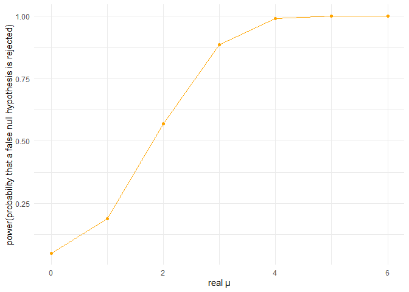

P8105_hw5_zz3309
================
Zebang Zhang
2024-11-10

``` r
library(broom)
library(tidyverse)
```

    ## ── Attaching core tidyverse packages ──────────────────────── tidyverse 2.0.0 ──
    ## ✔ dplyr     1.1.4     ✔ readr     2.1.5
    ## ✔ forcats   1.0.0     ✔ stringr   1.5.1
    ## ✔ ggplot2   3.5.1     ✔ tibble    3.2.1
    ## ✔ lubridate 1.9.3     ✔ tidyr     1.3.1
    ## ✔ purrr     1.0.2     
    ## ── Conflicts ────────────────────────────────────────── tidyverse_conflicts() ──
    ## ✖ dplyr::filter() masks stats::filter()
    ## ✖ dplyr::lag()    masks stats::lag()
    ## ℹ Use the conflicted package (<http://conflicted.r-lib.org/>) to force all conflicts to become errors

# Problem 1

First, I wrote a simulation function and ran the simulation.

``` r
set.seed(1)

birthday_simulation <- function(n) {
  birthdays <- sample(1:365, n, replace = TRUE) 
  return(any(duplicated(birthdays)))
}

simulation_num <- 10000 
group_sizes <- 2:50    
probabilities <- numeric(length(group_sizes))

for (i in seq_along(group_sizes)) {
  group_size <- group_sizes[i]
  results <- replicate(simulation_num, birthday_simulation(group_size))
  probabilities[i] <- mean(results) 
}

results_table <- data.frame(group_size = group_sizes, probability = probabilities)
print(results_table)
```

    ##    group_size probability
    ## 1           2      0.0024
    ## 2           3      0.0085
    ## 3           4      0.0167
    ## 4           5      0.0267
    ## 5           6      0.0399
    ## 6           7      0.0521
    ## 7           8      0.0751
    ## 8           9      0.0925
    ## 9          10      0.1158
    ## 10         11      0.1394
    ## 11         12      0.1655
    ## 12         13      0.1916
    ## 13         14      0.2229
    ## 14         15      0.2496
    ## 15         16      0.2861
    ## 16         17      0.3157
    ## 17         18      0.3439
    ## 18         19      0.3788
    ## 19         20      0.4120
    ## 20         21      0.4387
    ## 21         22      0.4792
    ## 22         23      0.5016
    ## 23         24      0.5386
    ## 24         25      0.5718
    ## 25         26      0.5967
    ## 26         27      0.6255
    ## 27         28      0.6482
    ## 28         29      0.6760
    ## 29         30      0.7049
    ## 30         31      0.7338
    ## 31         32      0.7462
    ## 32         33      0.7843
    ## 33         34      0.7979
    ## 34         35      0.8167
    ## 35         36      0.8223
    ## 36         37      0.8399
    ## 37         38      0.8674
    ## 38         39      0.8731
    ## 39         40      0.8882
    ## 40         41      0.9007
    ## 41         42      0.9132
    ## 42         43      0.9243
    ## 43         44      0.9366
    ## 44         45      0.9405
    ## 45         46      0.9470
    ## 46         47      0.9532
    ## 47         48      0.9618
    ## 48         49      0.9660
    ## 49         50      0.9720

``` r
plot(group_sizes, probabilities, type = "o", col = "blue",
     xlab = "group size", ylab = "probability that at least two people share a birthday")
```

<!-- -->

From the plot, we can see the probability that at least two people share
a birthday increases as group size increases. Although initially, the
probability is small, when group size reach about 30, the probability is
above 70%, and when group size reach 50, the probability is very close
to 1, meaning that it is much possible to see at least two people share
a birthday.

# Problem 2

First, write the simulation function and run the simulations.

``` r
set.seed(1)     
n <- 30           
sigma <- 5        
mu_values <- 0:6

run_simulation <- function(mu, n, sigma, n_simulations = 5000, alpha = 0.05) {
  
  estimates <- numeric(n_simulations)
  p_values <- numeric(n_simulations)
  
  for (i in 1:n_simulations) {
    x <- rnorm(n, mean = mu, sd = sigma)
    test_result <- t.test(x, mu = 0)
    test_tidy <- tidy(test_result)
    estimates[i] <- test_tidy$estimate
    p_values[i] <- test_tidy$p.value
  }
  
  power <- mean(p_values < alpha)
  mean_estimate <- mean(estimates)
  mean_estimate_rejected <- mean(estimates[p_values < alpha])
  
  return(list(
    mu = mu, 
    power = power, 
    mean_estimate = mean_estimate, 
    mean_estimate_rejected = mean_estimate_rejected,
    estimates = estimates, 
    p_values = p_values
  ))
}

simulation_results <- lapply(mu_values, run_simulation, n = n, sigma = sigma)
```

``` r
results_df <- do.call(rbind, lapply(simulation_results, function(x) {
  data.frame(mu = x$mu, power = x$power, mean_estimate = x$mean_estimate, 
             mean_estimate_rejected = x$mean_estimate_rejected)
}))
print(results_df)
```

    ##   mu  power mean_estimate mean_estimate_rejected
    ## 1  0 0.0508 -0.0002620935             0.04259462
    ## 2  1 0.1890  0.9960495017             2.21411118
    ## 3  2 0.5684  2.0036531015             2.60385911
    ## 4  3 0.8872  2.9898295645             3.18297419
    ## 5  4 0.9918  3.9932014077             4.01144536
    ## 6  5 1.0000  5.0069890978             5.00698910
    ## 7  6 1.0000  6.0177066259             6.01770663

Then make plots to the simulation results.

``` r
ggplot(results_df, aes(x = mu, y = power)) +
  geom_line(color = "orange") +
  geom_point(color = "orange") +
  labs(x = "real μ", y = "power(probability that a false null hypothesis is rejected)") +
  theme_minimal()
```

<!-- -->

``` r
ggplot(results_df, aes(x = mu)) +
  geom_line(aes(y = mean_estimate, color = "Estimated μ"), linetype = "solid") +
  geom_point(aes(y = mean_estimate, color = "Estimated μ")) +
  geom_line(aes(y = mean_estimate_rejected, color = "Estimated μ when rejecting the null"), linetype = "dashed") +
  geom_point(aes(y = mean_estimate_rejected, color = "Estimated μ when rejecting the null")) +
  labs(x = "real μ", y = "the average estimate of μ") +
  theme_minimal() +
  scale_color_manual(values = c("Estimated μ" = "red", 
                                "Estimated μ when rejecting the null" = "blue")) +
  guides(color = guide_legend(title = "Estimation type"))
```

<!-- -->

From the first plot, we can see that the power of the test increases as
the real μ increases, this is because the real μ value gets farther from
value 0. So effect size and power have a positive correlation.

From the second plot, we can see that the sample averages of μ across
tests for which the null is rejected are not always approximately equal
to the true value of μ. When real u equals 1, 2, and 3, the estimated μ
when rejecting the null is not approximately equal to the real μ. This
is because for cases where the effect size is small, the noise in the
sample data is large, if we exclude the tests for which the null is not
rejected, estimates of the mean may be biased. Since we do the iteration
for 5000 times, which is a large number, the estimated μ will always
close to the real μ if we just consider all the tests no matter if its
null is rejected.

# Problem 3

``` r
homicide_data <- read.csv("homicide-data.csv")

str(homicide_data)
```

    ## 'data.frame':    52179 obs. of  12 variables:
    ##  $ uid          : chr  "Alb-000001" "Alb-000002" "Alb-000003" "Alb-000004" ...
    ##  $ reported_date: int  20100504 20100216 20100601 20100101 20100102 20100126 20100127 20100127 20100130 20100210 ...
    ##  $ victim_last  : chr  "GARCIA" "MONTOYA" "SATTERFIELD" "MENDIOLA" ...
    ##  $ victim_first : chr  "JUAN" "CAMERON" "VIVIANA" "CARLOS" ...
    ##  $ victim_race  : chr  "Hispanic" "Hispanic" "White" "Hispanic" ...
    ##  $ victim_age   : chr  "78" "17" "15" "32" ...
    ##  $ victim_sex   : chr  "Male" "Male" "Female" "Male" ...
    ##  $ city         : chr  "Albuquerque" "Albuquerque" "Albuquerque" "Albuquerque" ...
    ##  $ state        : chr  "NM" "NM" "NM" "NM" ...
    ##  $ lat          : num  35.1 35.1 35.1 35.1 35.1 ...
    ##  $ lon          : num  -107 -107 -107 -107 -107 ...
    ##  $ disposition  : chr  "Closed without arrest" "Closed by arrest" "Closed without arrest" "Closed by arrest" ...

``` r
homicide_data |>
  distinct(disposition)
```

    ##             disposition
    ## 1 Closed without arrest
    ## 2      Closed by arrest
    ## 3        Open/No arrest

The raw data has 12 columns (variables). It records the detailed
information of homicides in different states and cities, including the
date when the homicide happened, the location where the homicide
happened, the victim’s name, race, age, sex, and the disposition
(“Closed without arrest”, “Closed by arrest”, “Open/No arrest”) of the
homicide.

``` r
#Create a city_state variable and then summarize within cities to obtain the total number of homicides and the number of unsolved homicides

homicide_data <- homicide_data %>%
  mutate(city_state = paste(city, state, sep = ", "))

summary_data <- homicide_data %>%
  group_by(city_state) %>%
  summarize(
    total_homicides = n(),
    unsolved_homicides = sum(disposition %in% c("Closed without arrest", "Open/No arrest")))

summary_data
```

    ## # A tibble: 51 × 3
    ##    city_state      total_homicides unsolved_homicides
    ##    <chr>                     <int>              <int>
    ##  1 Albuquerque, NM             378                146
    ##  2 Atlanta, GA                 973                373
    ##  3 Baltimore, MD              2827               1825
    ##  4 Baton Rouge, LA             424                196
    ##  5 Birmingham, AL              800                347
    ##  6 Boston, MA                  614                310
    ##  7 Buffalo, NY                 521                319
    ##  8 Charlotte, NC               687                206
    ##  9 Chicago, IL                5535               4073
    ## 10 Cincinnati, OH              694                309
    ## # ℹ 41 more rows

``` r
baltimore_data <- summary_data %>%
  filter(city_state == "Baltimore, MD")

baltimore_data
```

    ## # A tibble: 1 × 3
    ##   city_state    total_homicides unsolved_homicides
    ##   <chr>                   <int>              <int>
    ## 1 Baltimore, MD            2827               1825

``` r
#For the city of Baltimore, MD, use the prop.test function to estimate the proportion of homicides that are unsolved

prop_baltimore <- prop.test(baltimore_data$unsolved_homicides, baltimore_data$total_homicides)
#(prop_baltimore is saved as the output of prop.test)

baltimore_prop_ci <- tidy(prop_baltimore) %>%
  select(estimate, conf.low, conf.high)

baltimore_prop_ci
```

    ## # A tibble: 1 × 3
    ##   estimate conf.low conf.high
    ##      <dbl>    <dbl>     <dbl>
    ## 1    0.646    0.628     0.663

For the city of Baltimore, MD, the estimated proportion of homicides
that are unsolved is 0.6455607, the confidence interval is (0.6275625,
0.6631599).

``` r
#extract the proportion of unsolved homicides and the confidence interval for each city
city_proportions <- summary_data %>%
  mutate(
    prop_test = pmap(list(unsolved_homicides, total_homicides), prop.test),
    tidy_results = map(prop_test, tidy)
  ) %>%
  unnest(tidy_results) %>%
  select(city_state, estimate, conf.low, conf.high)
```

    ## Warning: There was 1 warning in `mutate()`.
    ## ℹ In argument: `prop_test = pmap(list(unsolved_homicides, total_homicides),
    ##   prop.test)`.
    ## Caused by warning in `.f()`:
    ## ! Chi-squared approximation may be incorrect

``` r
city_proportions
```

    ## # A tibble: 51 × 4
    ##    city_state      estimate conf.low conf.high
    ##    <chr>              <dbl>    <dbl>     <dbl>
    ##  1 Albuquerque, NM    0.386    0.337     0.438
    ##  2 Atlanta, GA        0.383    0.353     0.415
    ##  3 Baltimore, MD      0.646    0.628     0.663
    ##  4 Baton Rouge, LA    0.462    0.414     0.511
    ##  5 Birmingham, AL     0.434    0.399     0.469
    ##  6 Boston, MA         0.505    0.465     0.545
    ##  7 Buffalo, NY        0.612    0.569     0.654
    ##  8 Charlotte, NC      0.300    0.266     0.336
    ##  9 Chicago, IL        0.736    0.724     0.747
    ## 10 Cincinnati, OH     0.445    0.408     0.483
    ## # ℹ 41 more rows

``` r
#Create a plot that shows the estimates and CIs for each city
ggplot(city_proportions, aes(x = reorder(city_state, estimate), y = estimate)) +
  geom_point() +
  geom_errorbar(aes(ymin = conf.low, ymax = conf.high)) +
  coord_flip() +
  labs(
    title = "Proportion of unsolved homicides by city",
    x = "city_state",
    y = "proportion of unsolved homicides"
  ) +
  theme_minimal()
```

<!-- -->
